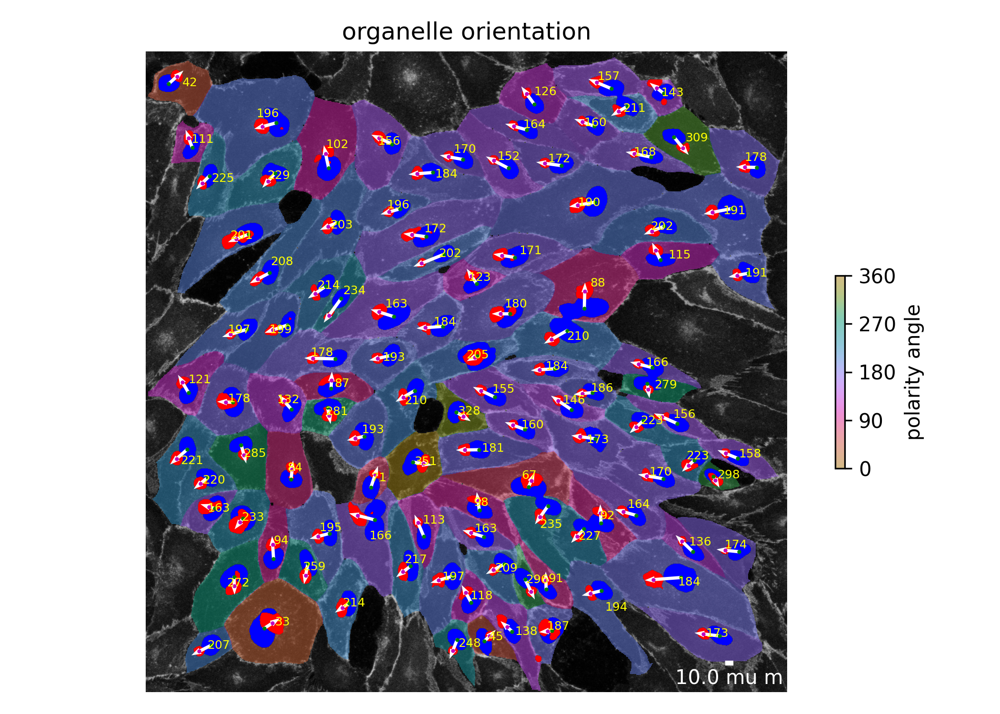
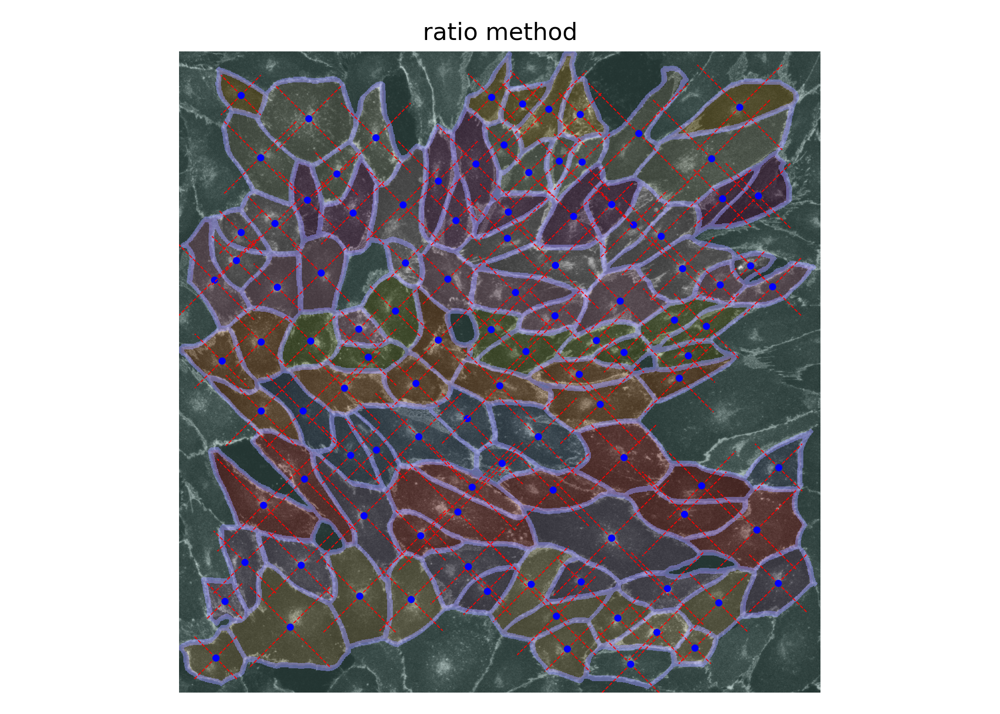
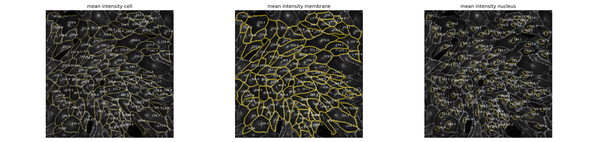
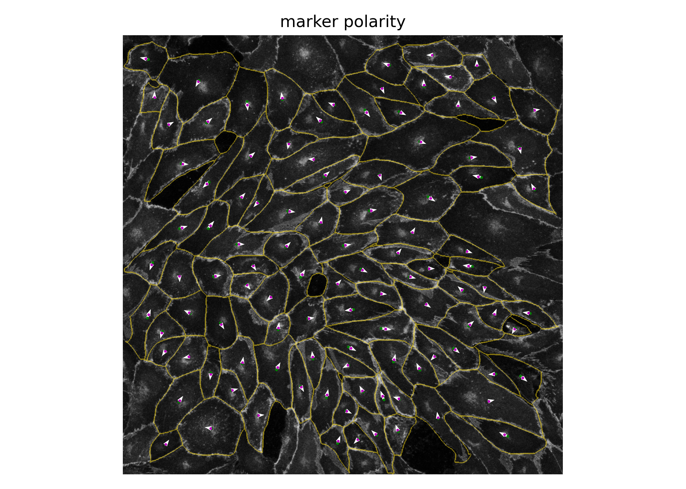
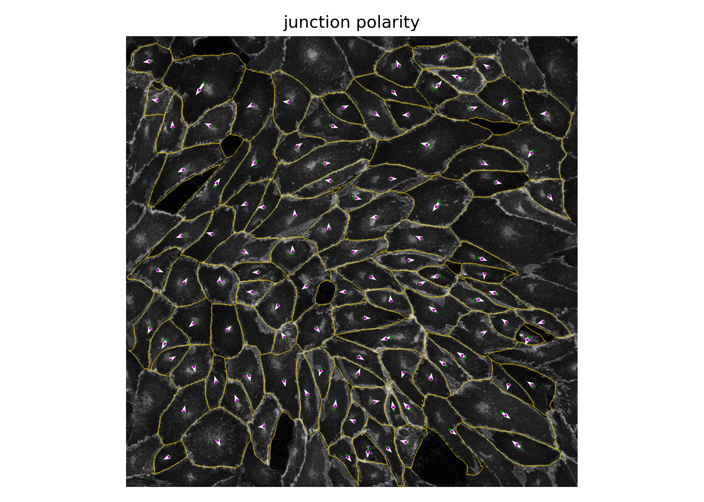

Visualizations
==============

Polarityjam optionally plots some of the features mentioned above for all cells. All plots are optionally.
If the plots are not needed we recommend to disable plotting in the paramters file to speed up calculation time.
The following visualizations can be generated:

- cellpose segmentation
- cell elongation
- organelle polarity
- ratio method
- marker expression
- marker polarity

Segmentation
------------
Segmentation of input image(s) are done with cellpose. Quality control of the segmentation output is a crucial step
for later downstream analysis. For that purpose the feature extraction pipeline creates for every input image a plot
showing the given channel configuration and the corresponding segmentation. An example can be seen below.
Here, first image (from left to right) is the junction channel, second the nuclei channel, and third the
segmentation mask.

.. image:: images/060721_EGM2_18dyn_02_cellpose_seg.png
   :width: 600

Elongation
----------

This plot shows the elongation of each cell and its corresponding nucleus in an input image.
The color ranging from blue to red giving a visual impression of the eccentricity. Coming from mathematics,
eccentricity actually is a non-negative real number that uniquely characterizes the shape of a conic section.
Since cells are closed and always form at most an ellipse the value can never be larger than or equal to 1.
Hence, the eccentricity here is a value ranging from 0 (here: blue) to close to 1 (here: red).

.. image:: images/060721_EGM2_18dyn_02_eccentricity.png
   :width: 600

Organelle polarity
------------------
If a golgi channel is present in the input images the organelle polarity plot can be enabled.
From the vector between the position of the center of the golgi apparatus and the position of the center of
the nucleus a polarity angle can be calculated. This angle has the value 0 if nucleus and golgi apparatus both lie on
the same height of the horizontal axis and the nuclei is positioned to the left of the golgi apparatus.
In the other case, when the nuclei is positioned to the right, the angle becomes 180°.
The vector is depicted in white, the nucleus contour in blue and the golgi area in red. Additionally,
a color gradient transparently tints the cells based on their organelle polarity angle.

Ratio method
------------
TBA

Cell shape and nuclei shape orientation
---------------------------------------
The shape and nuclei orientation plot shows the angle that spans between the horizontal axis of the cell to the major
axis of the cell, where an angle of 0 means the major axis of the cell is perfectly horizontal.
Because a cell has no head and tail the angle can only span from 0° to maximal 180°. For visual aid, a color
gradient colors the cell based on the value of its orientation.

.. image:: images/060721_EGM2_18dyn_02_shape_orientation.png
   :width: 600

Marker expression
-----------------

If a channel for the marker expression is given, the intensity of that channel can be visualized in each cell.
This is shown in the following plot in the first image. Additionally, the mean intensity of the junctions are
visualized in the second image. This graphical representation highly depends on the parameter
"membrane thickness" which should be set appropriately. The mean intensity of the nucleus is shown in
the third image and is only present if a nucleus channel is provided.

Marker polarity
---------------

The marker polarity shows the polarity for each cell for the marker expression.
The angle between the center of the cell (green dot) and the weighted center of the marker channel of the cell
(red dot) span a vector that is shown as a white arrow. Again, this angle has a value of 0 if the weighted marker
center is positioned on the same horizontal height and to the right of the center of the cell. The value takes 180
if the weighted marker center is position to the left, but still on the same horizontal axis.

Junction polarity
-----------------

The same analysis as has been done for the marker polarity with the marker channel can be done
with the junction channel. Again, the angle between center of the cell and the weighted center of the
junction channel can be calculated. The result can be visualized in the same way as before and is shown
in the image below.

